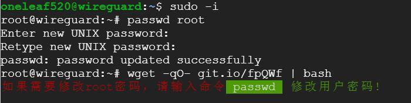

# 一键开启GCP实例的密码与root用户登陆
1、设置root的密码
```bash
sudo -i
passwd root
```
2、一键开启谷歌云实例的密码与root用户登陆
```bash
wget -qO- git.io/fpQWf | bash

备份版本
wget -qO- https://raw.githubusercontent.com/vsp6688/GCP-SSH-ROOT-OPEN/master/gcp_root_ssh.sh | bash
```
```
#!/bin/bash
#  脚本内容
#  Google Cloud Platform  GCP实例开启密码与root用户登陆

#  GCP一键启用root帐号命令
#  wget -qO- git.io/fpQWf | bash

# GCP 启用root密码登陆
sed -i "s/PermitRootLogin.*/PermitRootLogin yes/g"   /etc/ssh/sshd_config
sed -i "s/PasswordAuthentication.*/PasswordAuthentication yes/g"   /etc/ssh/sshd_config

# 重启ssh服务
systemctl restart ssh

#定义文字颜色
Green="\033[32m"  && Red="\033[31m" && GreenBG="\033[42;37m" && RedBG="\033[41;37m" && Font="\033[0m"

# 修改root 密码: bash脚本不能直接运行passwd，用户手工使用命令
echo -e "${Red}如果需要修改root密码，请输入命令${GreenBG} passwd ${Font}${Green} 修改用户密码! ${Font}"
echo
```


执行上述命令后，出现如下图所示内容，以后就无需科学上网环境，使用SSH客户端软件就能连接到谷歌云了。  
  

3、Ubuntu 18.04系统的方法   
执行上述第1、2步后，修改SSH的配置文件
```bash
vi /etc/ssh/sshd_config
```
4、 把下列选项的标注去掉（删除#号）
```bash
#PermitRootLogin yes 
#StrictModes yes
```
重启ssh服务 ```systemctl restart ssh``` 
如无法加载直接重启VPS ```reboot```
